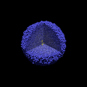

# PhysiLearning
[](https://github.com/sergiyayf/PhysiLearning/actions/workflows/ci.yaml)
[](https://codecov.io/github/sergiyayf/PhysiLearning)




PhysiLearning is a project in applying Reinforcement Learning to improve evolution based therapies
considering physical cell-cell interactions. This repository is mainly build on two great open source platforms:
[PhysiCell](https://github.com/MathCancer/PhysiCell) - for simulating tumor growth, and [Stable Baselines 3](https://github.com/DLR-RM/stable-baselines3) - for reinforcement learning.

## Installation
Clone the repository and install the main package with pip
```bash
git clone
cd PhysiLearning
pip install -e .
```

You will also need to install ZMQ cpp library. On Ubuntu:
```bash
sudo apt-get install libzmq-dev
```
After you installed zmq update ZMQLIB flag in src/PhysiCell_src/Makefile with the path to the library.

## Usage 

Usage of the package is aimed to be user-friendly and require minimal coding.
Most of the configuration is done through the config.yaml file that controls 
both the environment(simulation) and the agent.

See the config.yaml file for more details on the configuration, it should be self-explanatory.

### First steps  
To make sure that PhysiCell works on your machine, run the following command:
```bash
make raven
```
or 
```bash
make mela
```
depending on where you want to run the simulation. This will recompile PhysiCell with the options that are 
machine specific. 

### Training
To train the agent on ubuntu with installed slurm queuing system, run the following command:
```bash
python run.py train
```

#### List of example policies
This is for now only an example, these values will not work

| **Usage**       | **policy_kwargs**                                       | **Description**                                  |
|-----------------|---------------------------------------------------------|--------------------------------------------------|
| Number obs      | `dict('net_arch': dict('pi': [32, 32], 'vf': [32, 32))` | Control the size of actor and critic networks    |
| Image/Multi obs | `dict('cnn_output_dim': 16)`                            | Control number of extracted features from images |


### Evaluation
To evaluate the agent, run the following command:
```bash
python run.py evaluate
```

### Simulating virtual patients with barcode tracking
To simulate virtual patients with barcode tracking PhysiCell config via `./config.yaml` is not supported.
You need to first configure your simulation in the `./src/PhysiCell_src/config/PhysiCell_settings.xml` file.
Then you need to copy the PhysiCell source directory to the `./simulations` folder. You can do it with a script:
```bash
bash create_dirs.sh number_of_copies
```

Then you might need to reconfigure the `./scripts/simulate_patients_job.sh` script to load correct modules and use correct
resources. In config.yaml parameter `envs::PcEnv::cpus_per_sim` and `envs::PcEnv::transport_address` also need to be adjusted.

Then you can submit the jobs with:
```bash
python run.py simulate-patients --n_sims=number_of_simulations
```
On raven about 10 simulations will run in one job on one node in parallel.
In the script `./scripts/simulate_patients.py` parameter `num_episodes` will define how many times 
simulations from one directory will run. If you don't care about the PhysiCell original data, you can make
this number larger than 1. Data will be stored by the PCDL class into hdf5 file, 1 file per simulation folder, and 
will contain cell IDs, positions, barcodes, types and time in the current phase. 

### Run tests 

To run all tests, run the following command:
```bash
make pytest
```
or run single tests with:
```bash
pytest tests/test_evaluate.py
```


## Changelog

#### 0.3.3 Major Changes
- Refactor SLvEnv to more correct mutatnt position implementation
- Implement pcdl save and mutatnt position for PcEnv evaluation
- Refactor rewards
- Split 2D and 3D scripts and configs 

#### 0.3.1 Major Changes
- Fix SLvEnv reset bugs. 
- Change size limit to terminate instead of truncate
- Implement mutant_position observation in SLvEnv

#### 0.3.0 Major Changes
- Update to sb3 v2 
- Move environments from gym to gymnasium 
- Implement truncation and termination conditions (truncate if tumor size is too large, or timelimit is reached,
terminate if cells are not responding to treatment)
- Remove delay in treatment application
- Implement SLvEnv that is quasi-spatial version of Lotka-Volterra model, with mutant position tracking. Mutant is 
initially spawned at a predefined distance to the front cells layer. It is being slowly pushed out if within the 
growth layer. Competition coefficient is a function to the distance to the front, and if within the growth layer or behind.

#### 0.3.0 Minor Changes
- Update fixed evaluation strategies
- Add more tests
- Implement agent blindfolding for number observation from the yaml file
- Fix core dump, when 0 PhysiCells, related to saving treatment data in the .mat file

#### 0.2.4 Changes
- Implement sampling of patients from a range in PcEnv to do proper eval with KM plots
#### 0.2.3 Changes
- Added 'delayed_with_noise' growth flag for LvEnv that can be used for training to make the policy more robust. 
 
#### 0.2.2 Major changes
- None 

#### 0.2.2 Minor changes
- Added a new reward flags
- Added treatment custom var in PhysiCel for better pov rendering 
- Add black and white povs
- Fixed eval script reseting environment twice after finishm which caused issues evaling on PcEnvs  

#### 0.2.0 Major changes
- Added support for unique cell barcodes that allow full tree reconstruction
- Implemented PhysiCellDataListener in PUB/SUB communication pattern that listens to PhysiCell data communication channel
and saves communicated data that includes binary barcodes to one hdf5 file 
- Improved the speed of LV dense image sampling 
- Added sampling of different patients with predefined tumor parameters inside of environments
- Created a cohort of virtual patients to sample from

#### 0.2.0 Minor changes
- Added 6th reward flag for reward that takes size of the tumor into account 
- Updated documentation
- Added a gif to the Readme file

#### 0.1.6 Major changes
- Fully migrateted environment construction to BaseEnv class
- Cleaned up config.yaml file, and moved most of the environment parameters outside of the specific environments
- Implemented dictionary observation space for multiobs training 
- Added policy_kwargs parameter to config.yaml file for changing the policy architecture for training 
- Created a list of example policies in the Readme file
